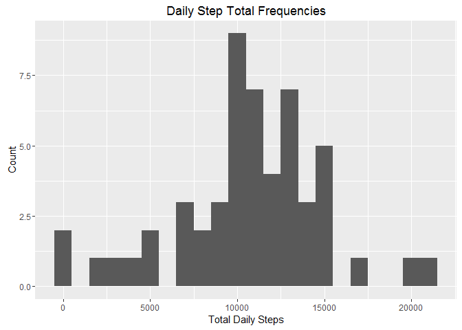
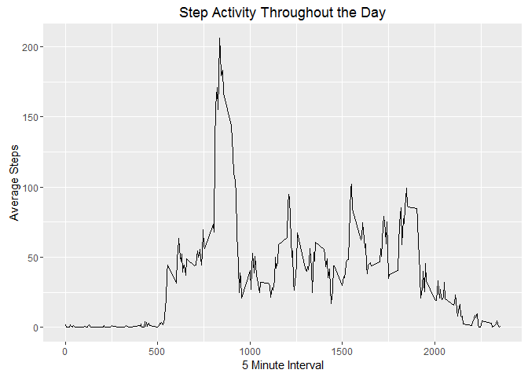
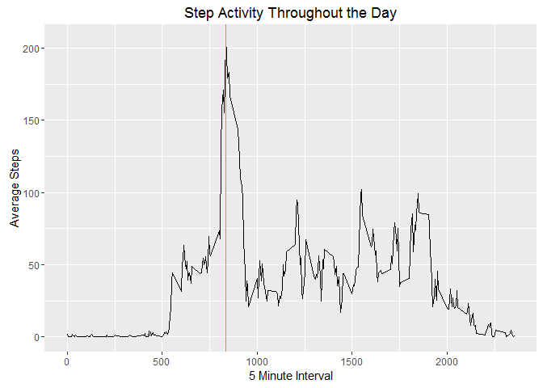
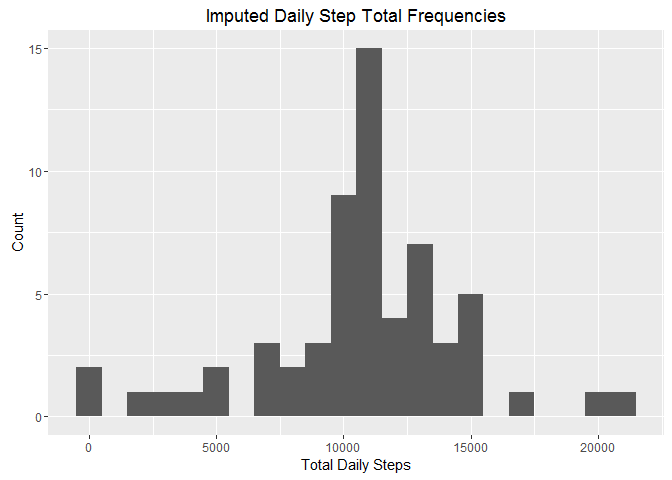
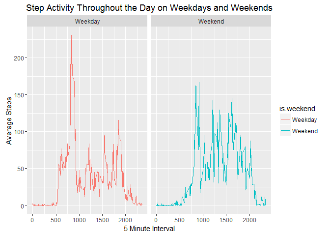

## Loading and preprocessing the data

The goal of this assignment is to become familiar with Rmarkdown and knitr as a method to produce reproducible research. To do this we will analyze data from a data set consisting of step data from a personal monitoring device and documenting our efforts using these tools. First, we must extract the data from the zip file if we have not already done so and read the resulting csv file.

```r
if (!file.exists("activity.csv")) {
  unzip("activity.zip")
}
activity <- read.csv("activity.csv")
```

We will use the dplyr and ggplot2 packages for working with and displaying the data.

```r
require(dplyr)
require(ggplot2)
```

## What is mean total number of steps taken per day?

To determine the number of steps taken each day we will use the diplyr package to calculate the total number of steps taken on a given day. From the activity dataset, entries containing NAs are removed. We then calculate the sum of the number of steps for each given day.

```r
daily.activity <- activity %>%
  na.omit() %>%
  group_by(date) %>%
  summarize(total = sum(steps))

head(daily.activity)
```

```
## # A tibble: 6 x 2
##   date       total
##   <fct>      <int>
## 1 2012-10-02   126
## 2 2012-10-03 11352
## 3 2012-10-04 12116
## 4 2012-10-05 13294
## 5 2012-10-06 15420
## 6 2012-10-07 11015
```

The resulting daily step data is plotted on a histogram.

```r
gg.daily <- ggplot(daily.activity, aes(total))
daily.plot <- gg.daily + 
  geom_histogram(binwidth = 1000) + 
  labs(title = "Daily Step Total Frequencies", 
       x = "Total Daily Steps", y = "Count")
daily.plot
```

<!-- -->

We can see that the number of steps per day are distributed around 10000. Next, we compute the mean daily step activity to be

```r
mean(daily.activity$total)
```

```
## [1] 10766.19
```

We also compute the median daily step activity to be

```r
median(daily.activity$total)
```

```
## [1] 10765
```

## What is the average daily activity pattern?

The step activity throughout the day is calculated by first removing entries containing NAs, then grouping the data by interval, and finally calculating the mean for each group.

```r
int.activity <- activity %>%
  na.omit() %>%
  group_by(interval) %>%
  summarize(average = mean(steps)) %>%
  mutate(type = "NAs Removed")

head(int.activity)
```

```
## # A tibble: 6 x 3
##   interval average type       
##      <int>   <dbl> <chr>      
## 1        0  1.72   NAs Removed
## 2        5  0.340  NAs Removed
## 3       10  0.132  NAs Removed
## 4       15  0.151  NAs Removed
## 5       20  0.0755 NAs Removed
## 6       25  2.09   NAs Removed
```

This gives us the average number of steps during that interval across all days.

```r
gg.interval <- ggplot(int.activity, aes(interval, average))
interval.plot <- gg.interval + 
  geom_line() + 
  labs(title = "Step Activity Throughout the Day", 
       x = "5 Minute Interval", y = "Average Steps")
interval.plot
```

<!-- -->

The line plot of the activity data shows decreased activity during early 5 minute intervals. The most active time is during the 5 minute interval

```r
time.of.max <- int.activity$interval[which.max(int.activity$average)]
time.of.max
```

```
## [1] 835
```

The number of steps during that interval is

```r
max(int.activity$average)
```

```
## [1] 206.1698
```

This max aligns with the peak we can see on our graph.

```r
interval.plot + geom_vline(aes(xintercept = time.of.max, color = "red"), show.legend = FALSE)
```

<!-- -->

## Imputing missing values

There are a number of missing values in the data set.

```r
sum(is.na(activity))
```

```
## [1] 2304
```

All of these missing entries are in the steps column.

```r
sapply(activity, function(x) sum(is.na(x)))
```

```
##    steps     date interval 
##     2304        0        0
```

To impute the missing data, we replace all NAs with the average steps for that interval.

```r
imputed.activity <- merge(activity, int.activity) %>%
  mutate(imputed.steps = ifelse(is.na(steps),
                        average,
                        steps))
head(imputed.activity)
```

```
##   interval steps       date  average        type imputed.steps
## 1        0    NA 2012-10-01 1.716981 NAs Removed      1.716981
## 2        0     0 2012-11-23 1.716981 NAs Removed      0.000000
## 3        0     0 2012-10-28 1.716981 NAs Removed      0.000000
## 4        0     0 2012-11-06 1.716981 NAs Removed      0.000000
## 5        0     0 2012-11-24 1.716981 NAs Removed      0.000000
## 6        0     0 2012-11-15 1.716981 NAs Removed      0.000000
```

There are no NAs in the imputed steps.

```r
sum(is.na(imputed.activity$imputed.steps))
```

```
## [1] 0
```

We then calculate the total number of steps on each day with the imputed data.

```r
imputed.daily.activity <- imputed.activity %>%
  group_by(date) %>%
  summarize(total = sum(imputed.steps)) %>%
  mutate(type = "Imputed")
head(imputed.daily.activity)
```

```
## # A tibble: 6 x 3
##   date       total type   
##   <fct>      <dbl> <chr>  
## 1 2012-10-01 10766 Imputed
## 2 2012-10-02   126 Imputed
## 3 2012-10-03 11352 Imputed
## 4 2012-10-04 12116 Imputed
## 5 2012-10-05 13294 Imputed
## 6 2012-10-06 15420 Imputed
```

Finally, we plot the imputed daily step totals on a histogram.

```r
imputed.daily.plot <- ggplot(imputed.daily.activity, aes(total)) +
  geom_histogram(binwidth = 1000) +
  labs(title = "Imputed Daily Step Total Frequencies", 
       x = "Total Daily Steps", y = "Count")
imputed.daily.plot
```

<!-- -->

We can see that we now have more entries around the middle of the distribution.

## Are there differences in activity patterns between weekdays and weekends?

We convert the date strings into date objects in order to determine the day of the week for each date.

```r
imputed.activity$date <- as.Date(imputed.activity$date)
```

We then label each date as a weekend or a weekday.

```r
weekends <- c("Saturday", "Sunday")
imputed.activity$is.weekend <- ifelse(weekdays(imputed.activity$date) %in% weekends,
                                      "Weekend",
                                      "Weekday")
head(imputed.activity)
```

```
##   interval steps       date  average        type imputed.steps is.weekend
## 1        0    NA 2012-10-01 1.716981 NAs Removed      1.716981    Weekday
## 2        0     0 2012-11-23 1.716981 NAs Removed      0.000000    Weekday
## 3        0     0 2012-10-28 1.716981 NAs Removed      0.000000    Weekend
## 4        0     0 2012-11-06 1.716981 NAs Removed      0.000000    Weekday
## 5        0     0 2012-11-24 1.716981 NAs Removed      0.000000    Weekend
## 6        0     0 2012-11-15 1.716981 NAs Removed      0.000000    Weekday
```

We compute the average number of steps for each interval on weekdays and weekends.

```r
weekday.activity <- imputed.activity %>%
  group_by(interval, is.weekend) %>%
  summarize(average = mean(imputed.steps))
head(weekday.activity)
```

```
## # A tibble: 6 x 3
## # Groups:   interval [3]
##   interval is.weekend average
##      <int> <chr>        <dbl>
## 1        0 Weekday     2.25  
## 2        0 Weekend     0.215 
## 3        5 Weekday     0.445 
## 4        5 Weekend     0.0425
## 5       10 Weekday     0.173 
## 6       10 Weekend     0.0165
```

Finally, we plot the average step data onto a line plot with weekends/weekdays as facets.

```r
weekday.plot <- ggplot(weekday.activity, aes(interval, average, fill = is.weekend)) + 
  geom_line(aes(color = is.weekend)) +
  facet_grid(.~is.weekend) + 
  labs(title = "Step Activity Throughout the Day on Weekdays and Weekends", 
       x = "5 Minute Interval", y = "Average Steps")
weekday.plot
```

<!-- -->

We can see that the large peak in activity in the middle of the day during the week is diminished during the weekends.
